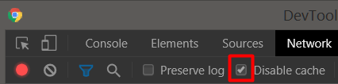
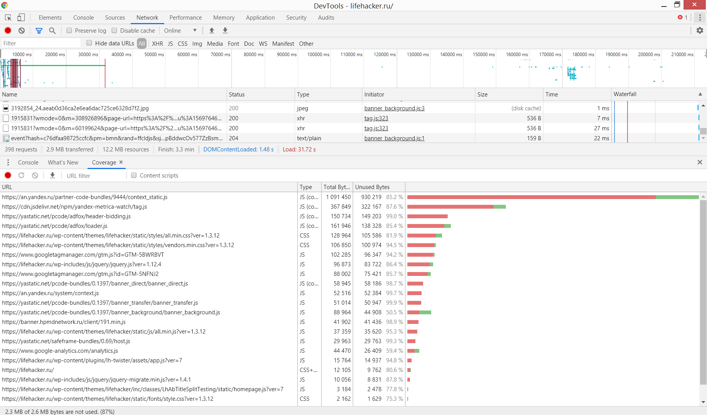
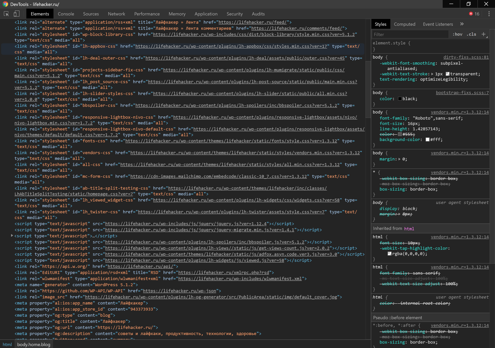

## Анализ сайта lifehacker.ru

[ТЗ](TASK.md)

- URL https://lifehacker.ru успешно открывается

- используется вкладка инкогнито с отключенными расширениями:

- на вкладке Network отключен кэш (Disable cache)

-  профиль загрузки ресурсов при открытии страницы

[har file](files/lifehacker.ru.har)
  
- дублирование ресурсов
  
| ресурс | кол-во |
|---|---|
| [show_ads_impl.js](https://pagead2.googlesyndication.com/pagead/js/r20190924/r20190131/show_ads_impl.js) | 8 |
| [adsbygoogle.js](https://pagead2.googlesyndication.com/pagead/js/adsbygoogle.js) | 5 |
| [osd.js?cb=%2Fr20100101](https://www.googletagservices.com/activeview/js/current/osd.js?cb=%2Fr20100101) | 5 |
| [adfox-adx-stub.js](https://yastatic.net/pcode/adfox/adfox-adx-stub.js) | 5 |
| [zrt_lookup.html](https://googleads.g.doubleclick.net/pagead/html/r20190924/r20190131/zrt_lookup.html) | 3 |
| [render.html](https://yastatic.net/safeframe-bundles/0.69/1-1-0/render.html) | 2 |
|  |  |
|  |  |

  - лишний размер ресурса
  - медленно загружающиеся ресурсы
  - ресурсы, блокирующие загрузку
  - что-то ещё
  - при описании найденных неоптимальных мест делать скриншот соответствующего участка панели Network, чтобы было понятно, что именно имеется в виду
  - (как работать со вкладкой Network: https://developers.google.com/web/tools/chrome-devtools/network)
- на вкладке Performance
  - записать и сохранить в файл профиль загрузки страницы
  - измерить время в миллисекундах от начала навигации до событий First Paint, First Meaningful Paint, DOM Content Loaded, Load
  - измерить, сколько времени в миллисекундах тратится на разные этапы обработки документа (Loading, Scripting, Rendering, Painting)
  - (как работать со вкладкой Performance: https://developers.google.com/web/tools/chrome-devtools/evaluate-performance)
- на вкладке Coverage
  - сохранить скриншот вкладки после загрузки страницы
  - измерить в килобайтах объём неиспользованного CSS в ходе загрузки страницы
  - измерить в килобайтах объём неиспользованного JS в ходе загрузки страницы
  - (как работать со вкладкой Coverage: https://developers.google.com/web/tools/chrome-devtools/coverage)
- в результате выполнения домашнего задания должны быть
  - два сохранённых профиля (Network и Performance)
  - описание неоптимальных мест при загрузке ресурсов со скриншотами
  - времена в миллисекундах от начала навигации до требуемых событий
  - объёмы неиспользованных в ходе загрузки страницы CSS и JS в килобайтах

### Coverage:

### Большое число ресурсов, подключаются  синхронно:

------------

## Бонус
Включить замедление CPU 4x slowdown и эмуляцию сети Slow 3G. Сделать такой же анализ.
