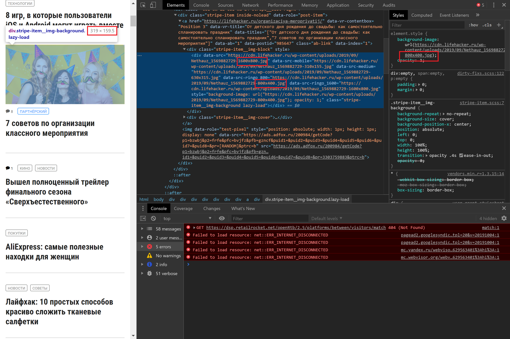
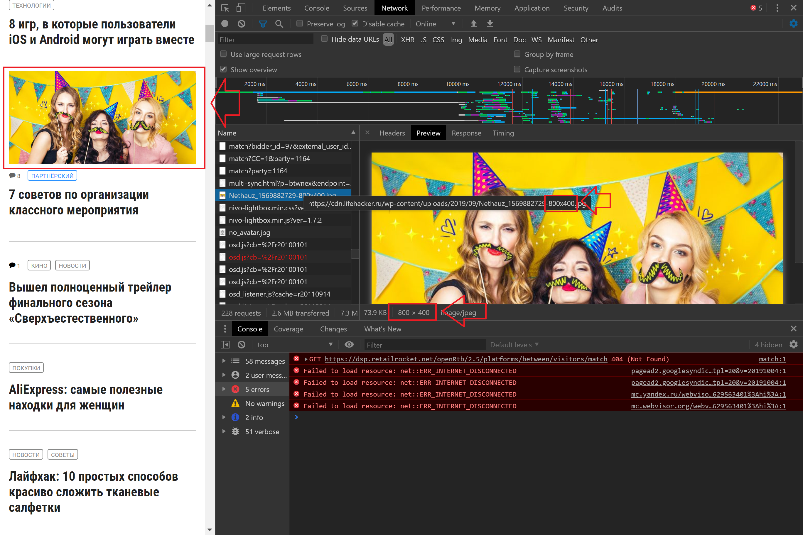
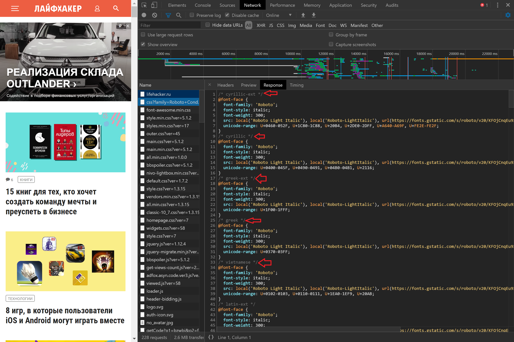

## Анализ сайта lifehacker.ru

[ТЗ](TASK.md)

### Сохранённые профили (Network и Performance)

Бэкап профилей:

- [Network har file](files/desktop/lifehacker.ru.har)
- [Performance](files/desktop/Profile-20190930T072356.json)

Бэкап профилей c тротлингом (CPU 4x slowdown и эмуляцию сети Slow 3G):

- [Network har file](files/with_throttling/lifehacker.ru.har)
- [Performance](files/with_throttling/Profile-20191005T162330.json)

### описание неоптимальных мест при загрузке ресурсов со скриншотами
 
#### дублирование ресурсов
  
| ресурс | кол-во |
|---|---|
| [show_ads_impl.js](https://pagead2.googlesyndication.com/pagead/js/r20190924/r20190131/show_ads_impl.js) | 8 |
| [adsbygoogle.js](https://pagead2.googlesyndication.com/pagead/js/adsbygoogle.js) | 5 |
| [osd.js?cb=%2Fr20100101](https://www.googletagservices.com/activeview/js/current/osd.js?cb=%2Fr20100101) | 5 |
| [adfox-adx-stub.js](https://yastatic.net/pcode/adfox/adfox-adx-stub.js) | 5 |
| [zrt_lookup.html](https://googleads.g.doubleclick.net/pagead/html/r20190924/r20190131/zrt_lookup.html) | 3 |
| [render.html](https://yastatic.net/safeframe-bundles/0.69/1-1-0/render.html) | 2 |
| [integrator.js?domain=lifehacker.ru](https://adservice.google.com/adsid/integrator.js?domain=lifehacker.ru) | 3 |  

#### Большое разрешение картинок

Некоторые картинки прилетают в более большом формате, чем могли бы быть

Например, картинка: Nethauz_1569882729-800x400.jpg

Прилетает с разрешением: 800x400, хотя открывал страничку я изначально на небольшом экране, и div, в который эта картинка должна прилететь имеет размеры: 319x159.5 и можно было спокойно кинуть картинку с разрешением: 400х200, вместо 800х400.

тоже самое касается других обложек статей:

- https://cdn.lifehacker.ru/wp-content/uploads/2019/08/business_cover_1566464714-800x400.jpg
- https://cdn.lifehacker.ru/wp-content/uploads/2019/10/8-igr-v-kotorye-polzovateli-iOS-i-Android-mogut-igrat-vmeste_1570198951-800x400.jpg
- https://cdn.lifehacker.ru/wp-content/uploads/2018/11/IMG_1975_1542804330-800x400.jpg
- https://cdn.lifehacker.ru/wp-content/uploads/2018/08/CHto-nuzhno-uchest-dlya-obustrojstva-idealnogo-sanuzla_1533944636-800x400.jpg
- https://cdn.lifehacker.ru/wp-content/uploads/2019/10/eda_budushchego_1570198032-800x400.jpg
- https://lifehacker.ru/wp-content/uploads/2019/08/B1_1567153464-630x315.jpg
- https://cdn.lifehacker.ru/wp-content/uploads/2019/10/6-priznakov-pishchevoj-allergii-kotorye-nelzya-ignorirovat_1570182964-800x400.jpg

#### Не мифицированные файлы

Некоторые файлы не минфицированны, а некоторые еще и содержат постфикс: min

пример не минифцированных ресурсов:

- https://lifehacker.ru/
- https://fonts.googleapis.com/css?family=Roboto+Condensed:400,700|Roboto:300,300i,400,400i,500,500i,700,900&subset=cyrillic
- https://lifehacker.ru/wp-content/plugins/lh-appbox/css/styles.min.css?ver=17
- https://lifehacker.ru/wp-content/plugins/lh-deal/assets/public/outer.css?ver=45
- https://lifehacker.ru/wp-content/plugins/lh-mumigrate/static/public/css/main.css?ver=5.1.2
- https://lifehacker.ru/wp-content/plugins/lh-spoilers/inc/bbspoiler.css?ver=5.1.2
- https://lifehacker.ru/wp-content/plugins/responsive-lightbox/assets/nivo/themes/default/default.css?ver=1.7.2

#### Комментарии в коде реурсов

Также в ресурсах присутвуют закомменченные участки кода, которые хороше бы вырезать при сборке

пример ресурсов с комментариями:

- https://fonts.googleapis.com/css?family=Roboto+Condensed:400,700|Roboto:300,300i,400,400i,500,500i,700,900&subset=cyrillic
- https://maxcdn.bootstrapcdn.com/font-awesome/4.7.0/css/font-awesome.min.css
- https://lifehacker.ru/wp-content/plugins/lh-deal/assets/public/outer.css?ver=45
- https://lifehacker.ru/wp-content/plugins/lh-slider/static/public/all.min.css?ver=1.0.0
- https://lifehacker.ru/wp-content/plugins/responsive-lightbox/assets/nivo/nivo-lightbox.min.css?ver=1.7.2
- https://lifehacker.ru/wp-content/plugins/responsive-lightbox/assets/nivo/themes/default/default.css?ver=1.7.2
- https://lifehacker.ru/wp-content/themes/lifehacker/static/styles/vendors.min.css?ver=1.3.15

#### Синхронное подключение ресурсов 

Большое число ресурсов, подключаются синхронно

### Временя в миллисекундах от начала навигации до требуемых событий

| Событие | времся, мс |
|---|---|
| First Paint | 4 307 |
| First Contentful Paint | 4 307 |
| First Meaningful Paint | 4 523 |
| DOM Content Loaded Event | 13 674 |
| OnLoad Event | 39 506 |

### объёмы неиспользованных в ходе загрузки страницы CSS и JS в килобайтах
  

| type | amount, KB |
|---|---|
| JS | 2202 |
| CSS | 255 |

В процентном соотношение не используется 59%