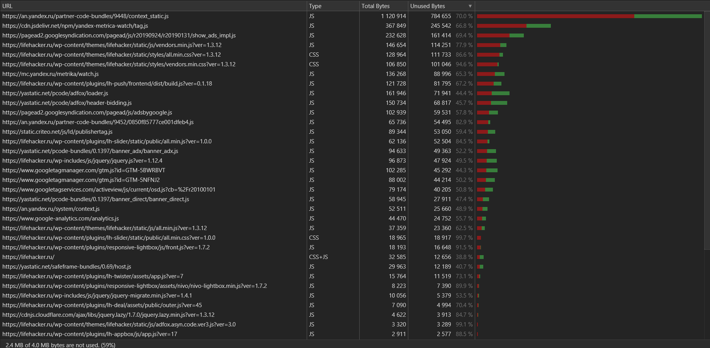

## Анализ сайта lifehacker.ru

[ТЗ](TASK.md)

### два сохранённых профиля (Network и Performance)
  Бэкап профилей:
- [Network har file](files/lifehacker.ru.har)
- [Performance](files/Profile-20190930T072356.json)

### описание неоптимальных мест при загрузке ресурсов со скриншотами
 
#### дублирование ресурсов
  
| ресурс | кол-во |
|---|---|
| [show_ads_impl.js](https://pagead2.googlesyndication.com/pagead/js/r20190924/r20190131/show_ads_impl.js) | 8 |
| [adsbygoogle.js](https://pagead2.googlesyndication.com/pagead/js/adsbygoogle.js) | 5 |
| [osd.js?cb=%2Fr20100101](https://www.googletagservices.com/activeview/js/current/osd.js?cb=%2Fr20100101) | 5 |
| [adfox-adx-stub.js](https://yastatic.net/pcode/adfox/adfox-adx-stub.js) | 5 |
| [zrt_lookup.html](https://googleads.g.doubleclick.net/pagead/html/r20190924/r20190131/zrt_lookup.html) | 3 |
| [render.html](https://yastatic.net/safeframe-bundles/0.69/1-1-0/render.html) | 2 |
| [integrator.js?domain=lifehacker.ru](https://adservice.google.com/adsid/integrator.js?domain=lifehacker.ru) | 3 |  

#### Не мифицированные файлы

Некоторые файлы не минфицированны, а некоторые еще и содержат постфикс: min

пример не минифцированных ресурсов:
- https://lifehacker.ru/
- https://fonts.googleapis.com/css?family=Roboto+Condensed:400,700|Roboto:300,300i,400,400i,500,500i,700,900&subset=cyrillic
- https://lifehacker.ru/wp-content/plugins/lh-appbox/css/styles.min.css?ver=17
- https://lifehacker.ru/wp-content/plugins/lh-deal/assets/public/outer.css?ver=45
- https://lifehacker.ru/wp-content/plugins/lh-mumigrate/static/public/css/main.css?ver=5.1.2
- https://lifehacker.ru/wp-content/plugins/lh-spoilers/inc/bbspoiler.css?ver=5.1.2
- https://lifehacker.ru/wp-content/plugins/responsive-lightbox/assets/nivo/themes/default/default.css?ver=1.7.2

#### Синхронное подключение ресурсов 

Большое число ресурсов, подключаются синхронно

### Временя в миллисекундах от начала навигации до требуемых событий

| Событие | времся, мс |
|---|---|
| First Paint | 4 307 |
| First Contentful Paint | 4 307 |
| First Meaningful Paint | 4 523 |
| DOM Content Loaded Event | 13 674 |
| OnLoad Event | 39 506 |

### объёмы неиспользованных в ходе загрузки страницы CSS и JS в килобайтах
  

| type | amount, KB |
|---|---|
| JS | 2202 |
| CSS | 255 |

В процентном соотношение не используется 59%